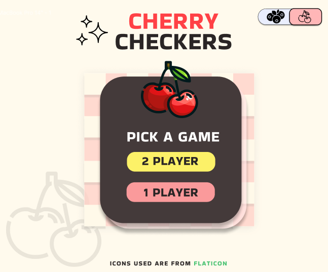
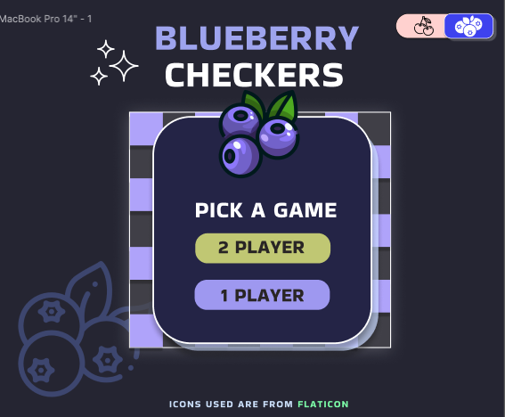

# SEI PROJECT 1: PLANNING STAGE
___

<h4>GAME CHOICE: <span style="color:red">CHECKERS</span></h4>

##### RULES OF CHECKERS:
- ###### WHO STARTS
  - First move is determined by a coin toss.
- ###### GAMEPLAY
  - Players move a checker piece each turn, with the objective of capturing all the opponent's pieces.
- ###### MOVEMENT
  - Normal pieces can only move <i>forward</i> diagonally or anti-diagonally.
  - If a normal piece reaches the first row on the opposite side of the board, that piece turns into a "King".
  - Once a piece becomes a "King", it can move forward and backward diagonally.
  - Pieces need to jump over an opponent's piece once encountered (have to be enforced)
  - Pieces can make multiple jumps over an opponent's piece if the moves are available in the same turn.
- ###### DETERMINING RESULTS
  - ##### WINNER
    - First player to capture all opponent pieces
    - Last player to have made the last move if current player is no longer able to move.
  - ##### LOSER
    - All of player's pieces are captured
    - Player can no longer make a move. Diagonal areas to make moves are blocked by opponent.
  - ##### TIE
    - Both players can no longer move ? 

___
##### (SOME) PLANNED APP FEATURES:
- As a player, having an option for a 2 player game or a game against a computer would be fun, because it give a more well-rounded gameplay experience.
- As a player, I would appreciate a day/night mode button toggle because it would be beneficial to me if I experience eye strain.

___
##### WIREFRAME:


###### SKELETON SKETCH


<hr style="border: none; background-color: #F2F4F7">


###### FIGMA SCREENSHOT
<b>Main screen</b>

- ##### Light Mode:


- ##### Dark Mode:


___
##### PSEUDOCODE:

```
1) Define constants
  1.1) constants that store values for player pieces
    - (1) and (-1)
  1.2) constants that store type of game
    - 1 player or 2 players
      - const 1_PLAYER = "1player";
      - const 2_PLAYER = "2player";

2) Define variables declared with "let", these values can change depending on buttons, representing game options that player clicks
  2.1) let game;
    - will store new game
  2.2) let gameType;
    - depending on user choice, will store:
      - 1_PlAYER or 2_PLAYER
  2.3) let nightModeOn = false;
    - if button associated is clicked:
      if (nightModeOn) {
        nightModeOn = true
        change theme to dark mode
      } else {
        nightModeOn = false
        change theme to day mode
      }

3) Cache DOM Elements
  3.1) Define Buttons using document.getElementById("");
    3.1.1) "play again" button
    3.1.2) "pick piece" button
      - 2 options
        - 2 different colors
        will be stored inside a "match player to color" object property inside Square class:
        static matchPlayerPiece = {
          '1': 'color1',
          '-1': 'color2',
          'null': 'nullColor',
        }
    3.1.3) "game type" button
      - 1 player or 2 players
    3.1.4) "day/night" mode button
      - toggles between cherry theme (day) and blueberry theme (night)
  3.2) H3 representing message
    3.2.1) Updates player turn
    3.2.2) Updates ending message
      - winner
      - tie
  3.3) Divs representing "board"
    3.3.1) divs that contains all the div square
      - inner div ("squares") represent areas that pieces can move along
  3.4) Square Divs that are "diagonal"
    - the inner divs of main board div
    - represent areas that pieces can move along
    - loop through main "board" div and store using filter method, index values that represent DIAGONAL squares
      - (1,3,5,7...)
      - create mechanism to store these specific index values using pattern
        - identify index values that are in the border
          - (1, 3, 5, 7, 23, 39, 55, 62, 60, 58, 56, 40, 24, 8)
        - length of border = 64
        - starting from index 1 to 63:
          - differences:
            - between rows = 2
            - diagonal (left to right) = 9
            - anti-diagonal (right to left) = 7
        - push diagonal divs into new array that represents movable areas

4) Attach event listeners to buttons available on main screen
  4.1 calls functions that set
    - day mode / night mode 
      - triggers color theme change
    - game type player chooses
    - game piece style player chooses

5) Define Square class
  5.1) define parameters for its constructor to be a domElement
  - Square class is instantiated in the the Checkers class
  5.2) define render method that updates the style of the square depending on its static property matchPlayerPiece key value
    - if piece is captured, the square it represents changes back to "null" color for that diagonal
    - if piece becomes "king", style changes to that

6) Define Checkers class, its properties and methods
  6.1) define properties
    - this.squareDivs (diagonal)
    - this.userKings = []; 
    - this.OpponentKings = []; 
    - this.totalUserPiece = 12;
    - this.totalComputerPiece = 12;
    - this.userPiecesIdx = [];
    - this.userPieceKingRow = [];
    - this.opponentPiecesIdx = [];
    - this.opponentPieceKingRow = [];
  6.2) define render methods 
    - render board
    - render check for winner
    - render message
      - winner
      - tie
      - call render turn
    - render whose turn
      - message change depending on current turn
    - render movements
      - computer (computerMakesMove())
        - loop over computer pieces that can move 
        - if piece index is not in the king array, then it can only move forward else it can move forward and backwards
        - loop over available diagonal divs
        - random pick computer piece and available diagonal index values
        - if no space available for all pieces, game ends and opponent wins
        - call checkCapture()
          - if a capture opportunity is available, capture movement is made
            - if more than one capture opportunity, first encounter in array loop is chosen 
        - call pieceCheck method to check if index is at the opponents king piece row array
        - call render()
          - square div at that index changes to piece color and previous square 
          - square div of previous piece changes back to null color
        - update turn to main player turn
        - call playerMakesMove()

      - player playerMakesMove()
        - add clickEvent to divs during player turn
        - store index of target diagonal square div
        - loop through available moves for every pieces still on board for player
        - add guards
          - if there is winner || diagonal square value is not null return
        - call checkWin()
        - call checkCapture()
        - call pieceCheck()
        - update turn
        - call render()

  6.3) define methods
    6.3.1) checkCapture()
      - create mechanism for capture scenario and options depending on if it is player or computer
      - if opponent piece is captured, reduce total piece -= 1
    6.3.2) checkWin()
      define end of game conditions
      - IF winner !== null:
        - change visibility to play again button = visible
        - add event listener to play again (function ends game)
          - calls endGame()
      - win or lose condition
        - win
          - opponent piece can no longer move or no more opponent piece
        - lose
          - no more moves left for current player
      - tie condition
      - ELSE return
    6.3.3) endGame()
      - winner, turn, = null
      - clearBoard()
      - initialize()
    6.3.4) clearBoard()
      - change colors back to if value was null
      - change visibility to play again button = hidden

7) Create a class inheritance of Checkers that represents the game if the "2 Player" option button is clicked
  - update methods that listen to the user's click on the div squares to allow multiple clicks until end game conditions are met
  - update computer method to copy first player method

8) Define Initialize and Main render functions that update:
  - what piece players pick
  - which player makes the first move
  - what game the main player chooses:
    - 2 players
    - Player vs Computer

9) Initialize function is immediatelly called first
  - calls other functions that render game mechanics:
    - functions that will create a new instance of the class Checkers or its subclass Checkers 2 Player

```