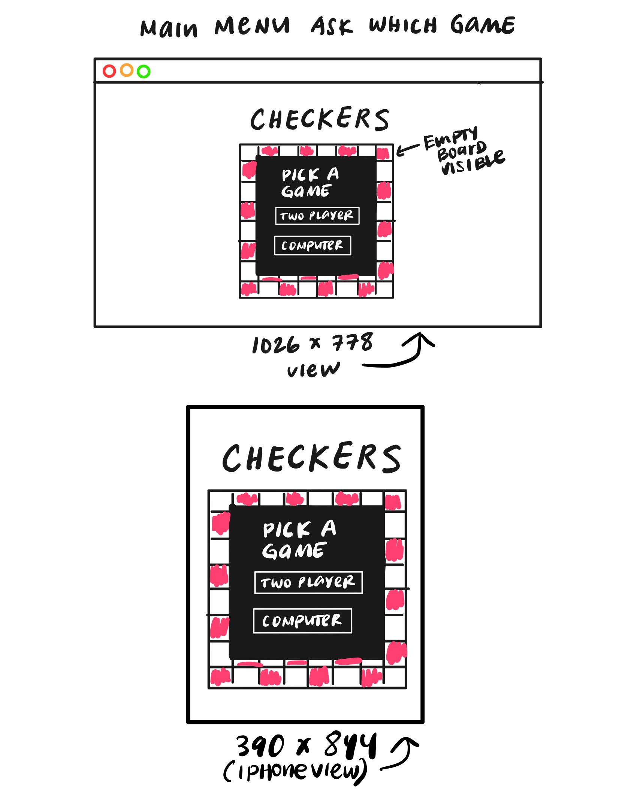
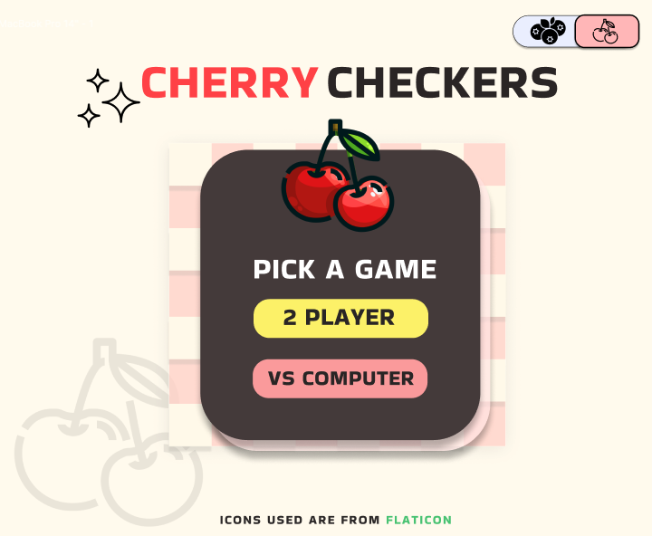

# SEI PROJECT 1: PLANNING STAGE
___

<h4>GAME CHOICE: <span style="color:red">CHECKERS</span></h4>

##### RULES OF CHECKERS:
- ###### WHO STARTS
  - First move is determined by a coin toss.
- ###### GAMEPLAY
  - Players move a checker piece each turn, with the objective of capturing all the opponent's pieces.
- ###### MOVEMENT
  - Normal pieces can only move <i>forward</i> diagonally.
  - If a normal piece reaches the first row on the opposite side of the board, that piece turns into a "King".
  - Once a piece becomes a "King", it can move forward and backward diagonally.
  - Pieces need to jump over an opponent's piece once encountered (have to be enforced)
  - Pieces can make multiple jumps over an opponent's piece if the moves are available in the same turn.
- ###### DETERMINING RESULTS
  - ##### WINNER
    - First player to capture all opponent's pieces
    - Last player to have made the last move if current player is no longer able to move.
  - ##### LOSER
    - All of player's pieces are captured
    - Player can no longer make a move. Diagonal areas to make moves are blocked by opponent.
  - ##### TIE
    - Both players can no longer move ? 

___
##### (SOME) PLANNED APP FEATURES:
- As a player, having an option for a 2 player game or a game against a computer would be fun, because it give a more well-rounded gameplay experience.
- As a player, I would appreciate a day/night mode button toggle because it would be beneficial to me if I experience eye strain.

___
##### WIREFRAME:


###### SKELETON SKETCH


<hr style="border: none; background-color: #F2F4F7">


###### FIGMA SCREENSHOT
<b>Main screen</b>




___
##### PSEUDOCODE:

```
1) Define constants and cache elements
- using document.getElementById(''), grab buttons and cache to respective variables 
- attach event listeners to buttons available on main screen
- define players and their respective piece choice
  - (1) for main player (first player)
  - (-1) for secondary player and computer
- define a constant object that matches player piece values to specific styles and icons to represent on the board
- define first player
  - determined by random roll of dice menu

2) Define main pieces of game
- define board array to represent each square div 
- define specific divs that pieces are allowed to move along
- define square divs that are along the border to represent max/min

3) Define Initialize and Main render functions that update:
  - what piece players pick
  - which player makes the first move
  - what game the main player chooses:
    - 2 player
    - Player vs Computer

4) Define Checkers class, its properties and methods
  - define opponent piece and user chosen piece 
  - define render methods 
    - render board
    - render whose turn
    - render message each turn
    - render check for winner
  - define end of game conditions
    - win condition
    - lose condition
    - tie condition
  
5) Create a class inheritance of Checkers that represents the game if the "2 Player" option button is clicked
  - update methods that listen to the user's click on the div squares to allow multiple clicks until end game conditions are met

6) Initialize function is immediatelly called first

7) If end of game conditions are met:
  - Replay button's visibility is set to "visible"
  - If clicked:
    - Initialize function is called, indicating a new game

```